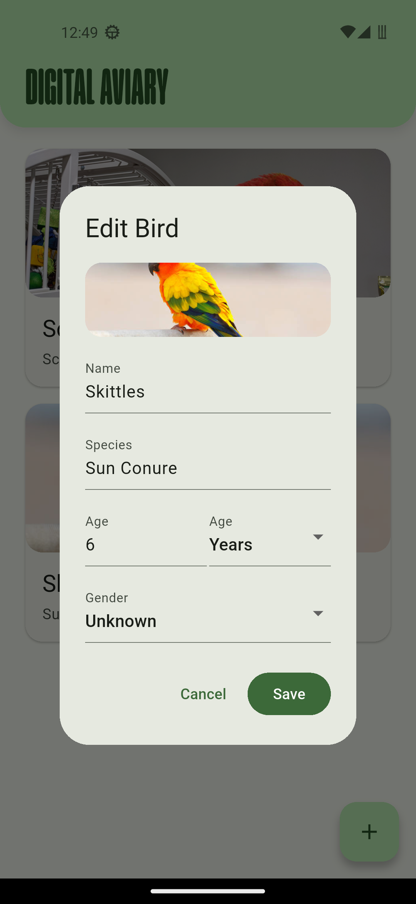
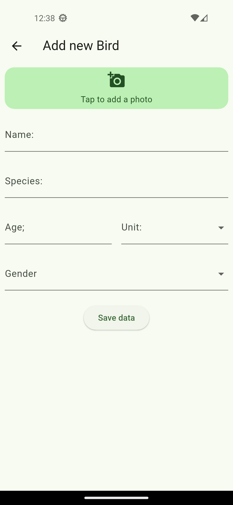
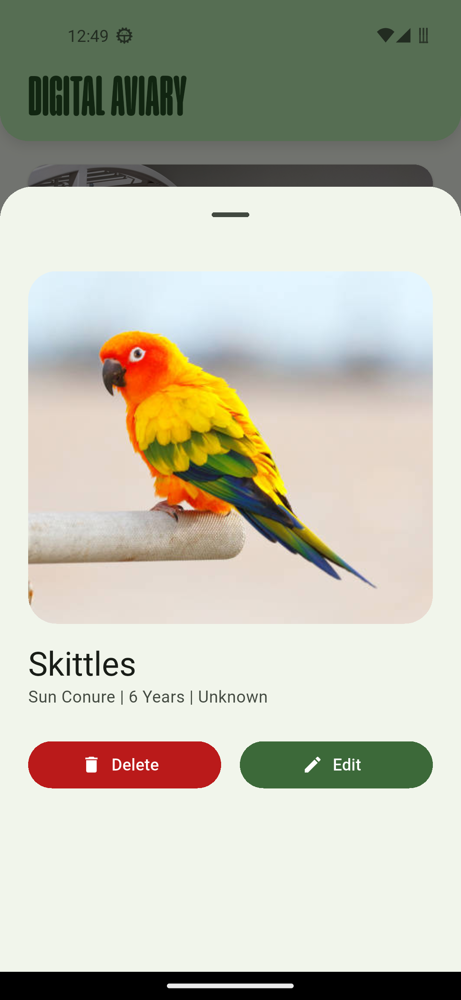
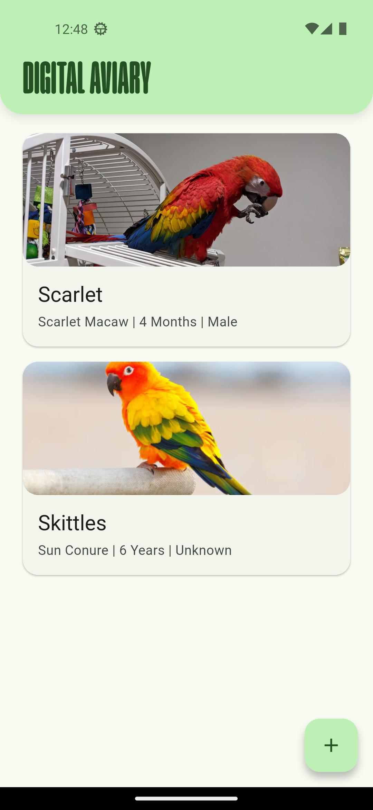

# 🦜 FeatherFlow

[](https://www.gnu.org/licenses/gpl-3.0)
[](https://flutter.dev)
[]()

**FeatherFlow** is an open-source, offline first avian management system built for bird breeders and enthusiasts worldwide. It provides a modern, privacy-respecting alternative to ad-filled legacy apps, featuring Material 3 design and on device data storage.

> Currently optimized specifically for Android to ensure a flawless mobile experience. Web optimization soon to be done, iOS/macOS support available via Flutter's cross-platform architecture.

---

##  Features

- **📸 Photo-First Bird Profiles** — Add high resolution images to easily identify birds
- **🎨 Material 3 Design** — Automatic light/dark mode with matching Material 3 theming
- **📴 Offline-First** — Zero internet required; all data stored locally on device
- **📱 Responsive Layout** — Vertical card gallery optimized for mobile and web

---

## 🛠️ Technical Challenges & Solutions

| Challenge | Solution | Why I Did It This Way |
| :--- | :--- | :--- |
| **Dropdowns Freezing in Edit Dialog** | Wrapped the dialog in `StatefulBuilder` | Dialogs in Flutter don't automatically update when the main screen changes. `StatefulBuilder` lets the dropdowns update instantly without needing to create a whole new screen class. |
| **Images Poking Out of Rounded Corners** | Used `ClipRRect` + `BoxFit.cover` | Images have sharp corners that break the rounded UI. `ClipRRect` cuts the image to match the rounded box, and `BoxFit.cover` ensures the photo fills the space without looking squished. |
| **Inconsistent Colors Across the App** | Used Material 3 Theme Presets | Hardcoding colors makes the app look messy across different screens. Using Material 3 presets (like `primaryContainer`) ensures every button, card, and text uses the exact same color
| **Parsing Age Data for the Edit Dialog** | String splitting and array manipulation | The app stores age as a single string (e.g., "2 Years"), but the edit dialog needs the number and unit separate. I wrote logic to split the string by spaces and match the last word to a list of valid units so the dropdowns pre-select correctly. |

---

## 📱 Screenshots

<div align="center">
  
  
</div>

<div align="center">
  
  
</div>

---

## 📦 Installation

### Prerequisites
- Flutter SDK 3.0 or higher
- Android Studio / VS Code with Flutter extensions

### Setup
```bash
# Clone the repository
git clone https://github.com/ibi-yz/featherflow.git
cd featherflow

# Install dependencies
flutter pub get

# Run the app
flutter run
```

### Build for Android
```bash
flutter build apk --release
```

---

## 🏗️ Architecture

FeatherFlow follows Flutter's reactive widget architecture with:
- **StatelessWidget** for static UI components
- **StatefulWidget** with `StatefulBuilder` for isolated dialog state
- **Material 3** theming via `ThemeData` color schemes
- **Local file storage** via `dart:io` for image persistence

---

## 🤝 Contributing

FeatherFlow is GPL v3 licensed. Contributions welcome!

1. Fork the repository
2. Create a feature branch (`git checkout -b feature/amazing-feature`)
3. Commit your changes (`git commit -m 'Add amazing feature'`)
4. Push to the branch (`git push origin feature/amazing-feature`)
5. Open a Pull Request

---

## 📄 License

This project is licensed under the **GNU General Public License v3.0** - see the [LICENSE](LICENSE) file for details.

---

**Made with ❤️ for bird breeders worldwide**
